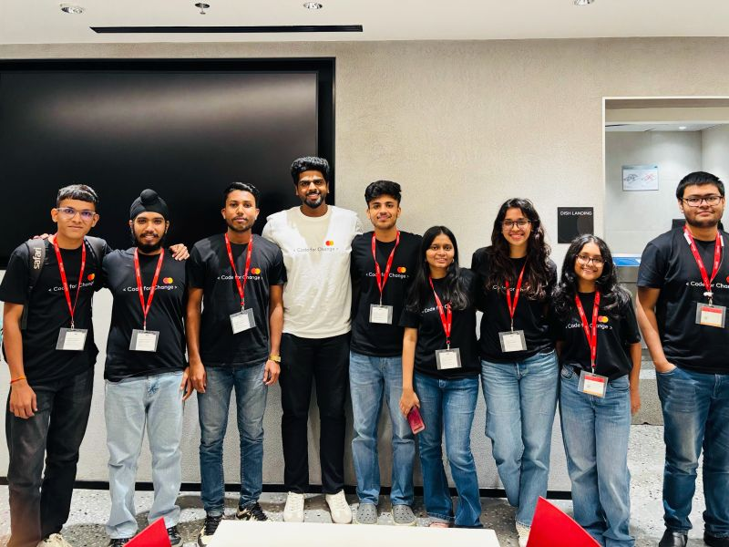

# 🎓 Katalyst — Gamified Learning & Student Engagement

**Built for Mastercard Code for Change 3.0.** Two portals (student and admin), a real product flow
from activity creation through XP, backed end-to-end by a real Express + MongoDB backend and real
Gemini LLM calls.

<p>
  
  
  
  
  
  
  
  
</p>

Auth, activities, enrollments, submissions, gamification, teams, notifications, feedback,
complaints, certificates, collaborations, and volunteer applications all call real endpoints — plus
an **AI Coach**, **AI Judge**, **AI Course Designer**, and an agentic **AI Chatbot** that can take
real actions, not mock data.

**📊 See [`FEATURES.md`](./FEATURES.md) for a complete, verified feature-by-feature audit.**

🔗 **Repository:** https://github.com/ridash2005/Mastercard-Code-for-Change-Team-10 · 🌐 **Live app:** https://frontend-ridash.vercel.app

---

## 📖 Table of Contents

- [Team](#team)
- [Live Deployment](#live-deployment)
- [Run It Locally](#run-it-locally)
- [Monorepo Layout](#monorepo-layout)
- [Tech Stack](#tech-stack)
- [Engineering Notes](#engineering-notes)

---

## 👥 Team

**Team 10 · Mastercard Code for Change 3.0**

<p align="center">
  
</p>

**🧑‍🏫 Mentor:** Vishal Gaikwad

**Team Members:**

| | | |
|---|---|---|
| Vaibhav Chavan | Gurpreet Singh Bhatia | Aditya Jadhav |
| Yash Kulkarni | Chinmayee Chaple | Ananya Munshi |
| Anshita Sarda | Rickarya Das | |

---

## 🚀 Live Deployment

Both halves are deployed on Vercel and wired to a real MongoDB Atlas cluster:

| | URL |
|---|---|
| 🌐 Frontend | https://frontend-ridash.vercel.app |
| ⚙️ Backend API | https://katalyst-backend-api.vercel.app/api (`/health` for a status/DB-connectivity check) |

**Demo accounts** (password `katalyst-demo-bridge-2026`):

| Role | Email |
|---|---|
| 🧑‍🎓 Student | `ananya@katalyst.edu` |
| 🛡️ Admin | `priya.admin@katalyst.edu` |

Both Vercel projects (`ridash/frontend`, `ridash/katalyst-backend-api`) are linked via `vercel link`
and redeployed with `vercel deploy --prod` — the frontend must be deployed from the **repo root**
(`vercel deploy --prod --cwd .`), since its Vercel project's Root Directory setting is `frontend`;
running it from inside `frontend/` directly fails with a "Root Directory does not exist" error.
See [`backend/api/README.md`](./backend/api/README.md#deploying-to-vercel)'s "Deploying to
Vercel" section for the Atlas-specific gotchas (SRV DNS, network access, `node_modules` vendoring,
the connection-race fix in `config/db.js`) if redeploying the backend.

---

## 🧑‍💻 Run It Locally

This needs a database — there's no mock-only mode anymore (every authenticated request re-checks
the caller against MongoDB, see `backend/api/middleware/authMiddleware.js`).

```bash
npm install
npm run dev:backend   # starts backend/api on :5000 - needs a reachable MONGO_URI
npm run dev           # starts the frontend on :3000, in another terminal
npm run seed --workspace @katalyst/backend-api   # first run only: seeds demo accounts + sample data
```

Open [http://localhost:3000](http://localhost:3000). Demo accounts (password
`katalyst-demo-bridge-2026`, matching `BACKEND_DEMO_PASSWORD`):

| Role | Email |
|---|---|
| 🧑‍🎓 Student | `ananya@katalyst.edu` |
| 🛡️ Admin | `priya.admin@katalyst.edu` |

`backend/api` itself still starts and serves `/api/health` without a reachable MongoDB, and every
other route fails fast with a `503` instead of hanging on a Mongoose timeout (see
`backend/api/middleware/dbMiddleware.js`) — but no authenticated request succeeds until Mongo is
reachable. See [`backend/api/.env.example`](./backend/api/.env.example) for the backend's env vars
(`MONGO_URI`, `JWT_SECRET`, `GEMINI_API_KEY`, `INTERNAL_AI_KEY`, `RESEND_API_KEY` for password-reset
email), and root [`.env.example`](./.env.example) for the frontend's own (`BACKEND_API_URL`,
`BACKEND_DEMO_PASSWORD`, `OCR_SPACE_API_KEY`).

> ⚠️ **Gemini free tier caps at 20 requests/day per model.** `GEMINI_API_KEY` may be a single key or
> a comma-separated list — `ai/ai-client`'s `GeminiClient` automatically falls back to the next key
> when one hits its quota, instead of failing the request outright. AI features also degrade
> gracefully when Gemini is unreachable entirely: Coach/Chatbot fall back to a local canned reply,
> the Judge stores the failure on the submission rather than blocking review.

---

## 🗂️ Monorepo Layout

| Path | What's there |
|---|---|
| `frontend/` | The Next.js app (student + admin portals, App Router, TypeScript, Tailwind, shadcn-style UI). Run via the root scripts above, or `cd frontend && npm run dev` directly. `frontend/lib/data/platform-store.ts` (Zustand) is a client-side cache hydrated from real `backend/api` responses on login — not a mock data source; see `frontend/lib/services/api.ts` for the typed client and `frontend/app/api/backend/[...path]/route.ts` for the authenticated proxy it goes through. |
| `backend/api` | The real backend: Express + MongoDB (auth, users, activities, submissions, meetings, gamification, teams, notifications, collaborations, volunteer applications, etc.), and the **only** path into `/ai` — see `backend/api/services/ai/` for the guardrail + auth layer in front of the AI gateway (`POST /api/ai/coach/message`, `POST /api/ai/chatbot/message`, `POST /api/ai/judge/score-submission`). |
| `backend/shared-types` | TS types shared between the `/ai` packages. |
| `ai/` | AI client (Gemini), AI Judge, AI Coach prompt/schema, and the Python matching/eval packages. Fully unit-tested in isolation (`npm test` at the root, `pytest` in `ai/python`). `backend/api` imports the compiled `ai/ai-client` package directly (not over HTTP) — run `npm run build:ai` after changing anything under `ai/*/src` so `backend/api` picks it up. The seed rubrics and XP-scaling math from `ai/ai-judge` are separately ported into plain JS at `backend/api/services/ai/{rubrics,computeXp}.js`, since `backend/api` can't import that compiled TS package the same way it does `ai-client` — keep both in sync if the spec's rubrics change. |
| `KATALYST_*_SPEC.md` | The authoritative specs for each layer (aspirational in places — e.g. the backend spec describes Next.js Route Handlers, while `backend/api` is a standalone Express service). |

`npm test` and `npm run typecheck` cover the `ai/`/`backend/shared-types` workspace packages plus
the frontend build. `backend/api` has its own integration test script (`npm run test:api --workspace
@katalyst/backend-api`, see [`backend/api/API_TESTING.md`](./backend/api/API_TESTING.md)).

---

## 🛠️ Tech Stack

**Frontend** — Next.js App Router, TypeScript, Tailwind CSS, shadcn-style UI, Lucide-ready layout,
React Hook Form + Zod, Zustand as a client cache over real backend data.

**Backend** — Express, Mongoose, JWT auth, MongoDB Atlas.

**AI** — Gemini via `@katalyst/ai-client` (with multi-key fallback), Zod-validated schemas.

**Other** — OCR.space for document scanning, Resend for transactional email, Vercel for hosting.

---

## 📝 Engineering Notes

- 🔐 Auth is real end-to-end: bcrypt + JWT in `backend/api`, an httpOnly session cookie set by
  `frontend/app/api/auth/{register,login,logout,me}/route.ts`, never exposed to client JS.
- 🛡️ The AI gateway is guardrailed: input/output validation, regex-based prompt-injection and PII
  detection, per-route rate limiting, and an internal-service-key gate on the (non-client-facing)
  AI Judge scoring route — see `backend/api/services/ai/` and `KATALYST_AI_SPEC.md`. The AI Judge
  itself runs as a backend job triggered automatically on submission (per the spec's §2.1, never a
  browser-triggered call), not via that gated route — see `backend/api/services/submissionService.js`.
- 🤖 The Chatbot can perform real actions (enroll, submit feedback/complaints, mark notifications
  read, reschedule, draft a course) in addition to answering questions — see
  `backend/api/services/ai/chatbotService.js` and `backend/api/services/chatbotActionService.js`.
- 🔁 The Gemini client falls back across multiple `GEMINI_API_KEY` values on quota exhaustion
  instead of failing outright — see `ai/ai-client/src/index.ts`'s `withKeyFallback`.
- ⚡ `backend/api/config/db.js` caches the Mongo connection attempt as a promise that request
  middleware in `server.js` awaits, rather than firing `connectDB()` at module load and never
  waiting on it. On a serverless platform (Vercel) that fire-and-forget pattern lets a request's
  `readyState` check race a connection that's still mid-flight, appearing permanently "connecting"
  even after it has actually succeeded or failed — this bit us during the first deploy.
