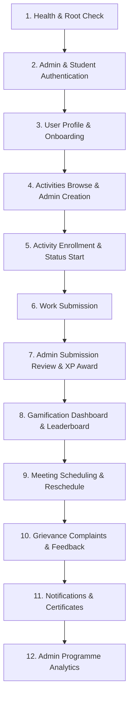

# Katalyst Backend API Testing Guide (Postman-Ready)

This document contains complete, Postman-ready testing specifications for all non-AI backend APIs in `backend/api`.

---

## Environment Setup for Postman

Create a Postman Environment with the following variables:

| Variable | Initial Value | Description |
|---|---|---|
| `baseUrl` | `http://localhost:5000` | Backend server URL |
| `studentToken` | *(leave empty, populated after student login)* | JWT token for student account |
| `adminToken` | *(leave empty, populated after admin login)* | JWT token for admin account |
| `activityId` | *(populated from activity list/create)* | ID of an activity |
| `submissionId`| *(populated after submitting work)* | ID of a submission |
| `meetingId` | *(populated from meetings list)* | ID of a meeting |

---

## Recommended Testing Order



---

## 1. System & Health Check

### 1.1 Root API Directory
- **Method:** `GET`
- **URL:** `{{baseUrl}}/`
- **Headers:** `None`
- **Auth:** None
- **Expected Status:** `200 OK`
- **Expected Response:**
```json
{
  "success": true,
  "message": "Welcome to Katalyst Backend API",
  "version": "1.0.0",
  "endpoints": {
    "health": "/api/health",
    "auth": {
      "register": "POST /api/auth/register",
      "login": "POST /api/auth/login",
      "me": "GET /api/auth/me (Protected)",
      "onboarding": "POST /api/auth/onboarding (Protected)"
    }
  }
}
```

### 1.2 Health Check
- **Method:** `GET`
- **URL:** `{{baseUrl}}/api/health`
- **Headers:** `None`
- **Auth:** None
- **Expected Status:** `200 OK`
- **Expected Response:**
```json
{
  "success": true,
  "status": "healthy",
  "database": "connected",
  "uptime": 12.34,
  "timestamp": "2026-08-21T14:30:00.000Z"
}
```

---

## 2. Authentication & Authorization

### 2.1 Student Login (Demo Account: Ananya)
- **Method:** `POST`
- **URL:** `{{baseUrl}}/api/auth/login`
- **Headers:**
  - `Content-Type: application/json`
- **Body:**
```json
{
  "email": "ananya@katalyst.edu",
  "password": "katalyst-demo-bridge-2026"
}
```
- **Expected Status:** `200 OK`
- **Postman Test Script (Tests tab):**
```js
pm.environment.set("studentToken", pm.response.json().data.token);
```
- **Expected Response:**
```json
{
  "success": true,
  "message": "Login successful",
  "data": {
    "user": {
      "id": "65d000000000000000000001",
      "name": "Ananya Munshi",
      "email": "ananya@katalyst.edu",
      "role": "student",
      "college": "St. Xavier's College, Mumbai",
      "programme": "Katalyst Fellows 2026",
      "avatar": "AM",
      "cohort": "Cohort 2026",
      "batchYear": 2,
      "onboardingCompleted": true
    },
    "profile": {
      "userId": "65d000000000000000000001",
      "skills": ["DSA", "React", "Communication"],
      "interests": ["Software Development", "Product Management"],
      "careerGoal": "Software Engineer",
      "xp": 2450,
      "streak": 7
    },
    "token": "eyJhbGciOiJIUzI1NiIsInR5cCI6IkpXVCJ9..."
  }
}
```

### 2.2 Admin Login (Priya Sharma)
- **Method:** `POST`
- **URL:** `{{baseUrl}}/api/auth/login`
- **Headers:**
  - `Content-Type: application/json`
- **Body:**
```json
{
  "email": "priya.admin@katalyst.edu",
  "password": "katalyst-demo-bridge-2026"
}
```
- **Expected Status:** `200 OK`
- **Postman Test Script:**
```js
pm.environment.set("adminToken", pm.response.json().data.token);
```

### 2.3 Register New Student
- **Method:** `POST`
- **URL:** `{{baseUrl}}/api/auth/register`
- **Headers:**
  - `Content-Type: application/json`
- **Body:**
```json
{
  "name": "Tanvi Deshmukh",
  "email": "tanvi.d@katalyst.edu",
  "password": "katalyst-demo-bridge-2026",
  "role": "student",
  "college": "COEP Pune",
  "programme": "Katalyst Fellows 2026",
  "cohort": "Cohort 2026",
  "batchYear": 2
}
```
- **Expected Status:** `201 Created`

### 2.4 Get Current User Profile (`/auth/me`)
- **Method:** `GET`
- **URL:** `{{baseUrl}}/api/auth/me`
- **Headers:**
  - `Authorization: Bearer {{studentToken}}`
- **Expected Status:** `200 OK`

### 2.5 Complete Onboarding Flow
- **Method:** `POST`
- **URL:** `{{baseUrl}}/api/auth/onboarding`
- **Headers:**
  - `Content-Type: application/json`
  - `Authorization: Bearer {{studentToken}}`
- **Body:**
```json
{
  "skills": ["Python", "SQL", "Git"],
  "interests": ["Data Science", "Machine Learning"],
  "careerGoal": "Data Analyst at fintech firm",
  "academicField": "Computer Science",
  "programmeYear": 3,
  "bio": "Third-year engineering student passionate about data-driven products."
}
```
- **Expected Status:** `200 OK`

---

## 3. Users & Profile Management

### 3.1 Get Profile (Self)
- **Method:** `GET`
- **URL:** `{{baseUrl}}/api/users/profile`
- **Headers:**
  - `Authorization: Bearer {{studentToken}}`
- **Expected Status:** `200 OK`

### 3.2 Update Profile
- **Method:** `PUT`
- **URL:** `{{baseUrl}}/api/users/profile`
- **Headers:**
  - `Content-Type: application/json`
  - `Authorization: Bearer {{studentToken}}`
- **Body:**
```json
{
  "name": "Ananya Munshi",
  "skills": ["DSA", "React", "Node.js", "System Design"],
  "interests": ["Software Development", "Fintech Rails"],
  "careerGoal": "Software Architect",
  "bio": "Building payment experiences for next billion users."
}
```
- **Expected Status:** `200 OK`

### 3.3 List All Users (Admin Only)
- **Method:** `GET`
- **URL:** `{{baseUrl}}/api/users?role=student&page=1&limit=10`
- **Headers:**
  - `Authorization: Bearer {{adminToken}}`
- **Expected Status:** `200 OK`

### 3.4 Get At-Risk Students (Admin Only)
- **Method:** `GET`
- **URL:** `{{baseUrl}}/api/users/students/at-risk`
- **Headers:**
  - `Authorization: Bearer {{adminToken}}`
- **Expected Status:** `200 OK`

---

## 4. Activities & Catalog

### 4.1 List Activities (with Filter Queries)
- **Method:** `GET`
- **URL:** `{{baseUrl}}/api/activities?domain=Payments%20%26%20Trust&difficulty=intermediate`
- **Headers:**
  - `Authorization: Bearer {{studentToken}}`
- **Expected Status:** `200 OK`
- **Expected Response (Array of Activity Cards with `enrollmentStatus`):**
```json
{
  "success": true,
  "count": 1,
  "data": [
    {
      "id": "65d200000000000000000001",
      "title": "Payments Studio",
      "description": "Build a mental model of card, UPI and wallet rails used in everyday commerce.",
      "type": "course",
      "domain": "Payments & Trust",
      "problemDomain": "Digital Payments",
      "category": "Certificate course",
      "difficulty": "intermediate",
      "xpReward": 220,
      "startDate": "2026-07-01",
      "dueDate": "2026-08-15",
      "durationHours": 12,
      "requirement": "mandatory",
      "certificate": true,
      "participation": "individual",
      "enrollmentStatus": "completed"
    }
  ]
}
```

### 4.2 Get Activity Details by ID
- **Method:** `GET`
- **URL:** `{{baseUrl}}/api/activities/65d200000000000000000001`
- **Headers:**
  - `Authorization: Bearer {{studentToken}}`
- **Expected Status:** `200 OK`

### 4.3 Create New Activity (Admin Only)
- **Method:** `POST`
- **URL:** `{{baseUrl}}/api/activities`
- **Headers:**
  - `Content-Type: application/json`
  - `Authorization: Bearer {{adminToken}}`
- **Body:**
```json
{
  "title": "Scalable Microservices with Node.js",
  "description": "Hands-on workshop breaking monoliths into event-driven microservices.",
  "type": "training",
  "domain": "Software Engineering",
  "problemDomain": "Campus Employability",
  "category": "Backend Studio",
  "difficulty": "intermediate",
  "xpReward": 150,
  "startDate": "2026-09-01",
  "dueDate": "2026-09-15",
  "durationHours": 6,
  "requirement": "optional",
  "certificate": true,
  "participation": "individual",
  "instructions": "Implement RabbitMQ consumer worker and submit repository link.",
  "location": "Zoom Studio A",
  "slots": ["2026-09-01T10:00:00.000Z", "2026-09-01T14:00:00.000Z"]
}
```
- **Expected Status:** `201 Created`
- **Postman Test Script:**
```js
pm.environment.set("activityId", pm.response.json().data.id);
```

### 4.4 Update Activity (Admin Only)
- **Method:** `PUT`
- **URL:** `{{baseUrl}}/api/activities/{{activityId}}`
- **Headers:**
  - `Content-Type: application/json`
  - `Authorization: Bearer {{adminToken}}`
- **Body:**
```json
{
  "xpReward": 180,
  "instructions": "Updated: Complete both RabbitMQ & Redis pub/sub exercises."
}
```
- **Expected Status:** `200 OK`

---

## 5. Activity Enrollments

### 5.1 Enroll in Activity
- **Method:** `POST`
- **URL:** `{{baseUrl}}/api/enrollments`
- **Headers:**
  - `Content-Type: application/json`
  - `Authorization: Bearer {{studentToken}}`
- **Body:**
```json
{
  "activityId": "{{activityId}}"
}
```
- **Expected Status:** `201 Created`
- **Expected Response:**
```json
{
  "success": true,
  "message": "Enrolled successfully",
  "data": {
    "id": "...",
    "activityId": "...",
    "studentId": "...",
    "status": "not_started",
    "progress": 0
  }
}
```

### 5.2 Start Enrolled Activity
- **Method:** `PATCH`
- **URL:** `{{baseUrl}}/api/enrollments/{{activityId}}/start`
- **Headers:**
  - `Authorization: Bearer {{studentToken}}`
- **Expected Status:** `200 OK`
- **Expected Response:**
```json
{
  "success": true,
  "message": "Activity started",
  "data": {
    "status": "in_progress",
    "progress": 15
  }
}
```

### 5.3 Get Student's Enrollments
- **Method:** `GET`
- **URL:** `{{baseUrl}}/api/enrollments`
- **Headers:**
  - `Authorization: Bearer {{studentToken}}`
- **Expected Status:** `200 OK`

---

## 6. Work Submissions & Review Flow

### 6.1 Submit Work (Student)
- **Method:** `POST`
- **URL:** `{{baseUrl}}/api/submissions`
- **Headers:**
  - `Content-Type: application/json`
  - `Authorization: Bearer {{studentToken}}`
- **Body:**
```json
{
  "activityId": "{{activityId}}",
  "text": "Completed event-driven order processing system with idempotency keys.",
  "link": "https://github.com/ananya-dev/microservices-demo",
  "notes": "Included Docker compose and Postman collection in repo root.",
  "fileName": "architecture-diagram.png"
}
```
- **Expected Status:** `201 Created`
- **Postman Test Script:**
```js
pm.environment.set("submissionId", pm.response.json().data.id);
```

### 6.2 Get Submissions (Admin Queue)
- **Method:** `GET`
- **URL:** `{{baseUrl}}/api/submissions?status=submitted`
- **Headers:**
  - `Authorization: Bearer {{adminToken}}`
- **Expected Status:** `200 OK`

### 6.3 Review Submission (Admin Approve)
- **Method:** `POST`
- **URL:** `{{baseUrl}}/api/submissions/{{submissionId}}/review`
- **Headers:**
  - `Content-Type: application/json`
  - `Authorization: Bearer {{adminToken}}`
- **Body:**
```json
{
  "action": "approve",
  "score": 95,
  "feedback": "Flawless idempotency implementation. Great job on the transaction logging!"
}
```
- **Expected Status:** `200 OK`
- **Expected Response:**
```json
{
  "success": true,
  "message": "Submission approved successfully",
  "data": {
    "status": "approved",
    "score": 95,
    "xpAwarded": 180,
    "feedback": "Flawless idempotency implementation. Great job on the transaction logging!"
  }
}
```

---

## 7. Gamification, XP & Leaderboard

### 7.1 Student Gamification Dashboard
- **Method:** `GET`
- **URL:** `{{baseUrl}}/api/gamification/dashboard`
- **Headers:**
  - `Authorization: Bearer {{studentToken}}`
- **Expected Status:** `200 OK`
- **Expected Response Structure:**
```json
{
  "success": true,
  "data": {
    "gamification": {
      "xp": 2630,
      "level": 7,
      "xpToNext": 170,
      "progress": 57.5,
      "streak": 7,
      "rank": 3,
      "completion": 75
    },
    "continueActivities": [],
    "upcomingDeadlines": [],
    "recommendations": [],
    "leaderboardPreview": []
  }
}
```

### 7.2 Global Leaderboard
- **Method:** `GET`
- **URL:** `{{baseUrl}}/api/gamification/leaderboard?limit=10`
- **Expected Status:** `200 OK`

### 7.3 Achievements & Unlocks
- **Method:** `GET`
- **URL:** `{{baseUrl}}/api/gamification/achievements`
- **Headers:**
  - `Authorization: Bearer {{studentToken}}`
- **Expected Status:** `200 OK`

### 7.4 XP History Ledger
- **Method:** `GET`
- **URL:** `{{baseUrl}}/api/gamification/xp-transactions`
- **Headers:**
  - `Authorization: Bearer {{studentToken}}`
- **Expected Status:** `200 OK`

---

## 8. Mentoring & Meeting Rescheduling

### 8.1 List Meetings
- **Method:** `GET`
- **URL:** `{{baseUrl}}/api/meetings`
- **Headers:**
  - `Authorization: Bearer {{studentToken}}`
- **Expected Status:** `200 OK`

### 8.2 Reschedule Meeting Slot
- **Method:** `POST`
- **URL:** `{{baseUrl}}/api/meetings/65d400000000000000000001/reschedule`
- **Headers:**
  - `Content-Type: application/json`
  - `Authorization: Bearer {{studentToken}}`
- **Body:**
```json
{
  "slot": "2026-08-25T16:00:00.000Z"
}
```
- **Expected Status:** `200 OK`

---

## 9. Teams & Squads

### 9.1 List Teams and Members
- **Method:** `GET`
- **URL:** `{{baseUrl}}/api/teams`
- **Expected Status:** `200 OK`

### 9.2 Add/Update Team Member (Admin Only)
- **Method:** `POST`
- **URL:** `{{baseUrl}}/api/teams/65d100000000000000000001/members`
- **Headers:**
  - `Content-Type: application/json`
  - `Authorization: Bearer {{adminToken}}`
- **Body:**
```json
{
  "studentId": "65d000000000000000000001",
  "role": "Frontend Developer",
  "contribution": 35
}
```
- **Expected Status:** `200 OK`

---

## 10. Notifications, Feedback & Complaints

### 10.1 List In-App Notifications
- **Method:** `GET`
- **URL:** `{{baseUrl}}/api/notifications`
- **Headers:**
  - `Authorization: Bearer {{studentToken}}`
- **Expected Status:** `200 OK`

### 10.2 Mark All Notifications Read
- **Method:** `PATCH`
- **URL:** `{{baseUrl}}/api/notifications/read-all`
- **Headers:**
  - `Authorization: Bearer {{studentToken}}`
- **Expected Status:** `200 OK`

### 10.3 Submit Platform Feedback
- **Method:** `POST`
- **URL:** `{{baseUrl}}/api/feedback`
- **Headers:**
  - `Content-Type: application/json`
  - `Authorization: Bearer {{studentToken}}`
- **Body:**
```json
{
  "category": "Curriculum Quality",
  "rating": 5,
  "message": "The payment rails workshop directly helped me in my internship interviews."
}
```
- **Expected Status:** `201 Created`

### 10.4 Submit Student Grievance / Complaint
- **Method:** `POST`
- **URL:** `{{baseUrl}}/api/complaints`
- **Headers:**
  - `Content-Type: application/json`
  - `Authorization: Bearer {{studentToken}}`
- **Body:**
```json
{
  "category": "Session Access",
  "subject": "Zoom link for Mentoring missing from calendar invite",
  "description": "My mentoring session with Priya is tomorrow, but the invite has no video link.",
  "priority": "high",
  "attachmentName": "calendar_screenshot.png"
}
```
- **Expected Status:** `201 Created`

---

## 11. Certificates & Extracurricular Activities

### 11.1 Get Issued Certificates
- **Method:** `GET`
- **URL:** `{{baseUrl}}/api/certificates`
- **Headers:**
  - `Authorization: Bearer {{studentToken}}`
- **Expected Status:** `200 OK`

### 11.2 List Extracurricular Events
- **Method:** `GET`
- **URL:** `{{baseUrl}}/api/extracurricular`
- **Expected Status:** `200 OK`

---

## 12. Contact Form & Admin Analytics

### 12.1 Submit Public Contact Form
- **Method:** `POST`
- **URL:** `{{baseUrl}}/api/contact`
- **Headers:**
  - `Content-Type: application/json`
- **Body:**
```json
{
  "name": "Prof. S. Kulkarni",
  "email": "skulkarni@college.edu",
  "category": "College Placement Cell",
  "message": "We would like to introduce the Katalyst programme to our 2nd year women engineers."
}
```
- **Expected Status:** `201 Created`

### 12.2 Admin Analytics Overview
- **Method:** `GET`
- **URL:** `{{baseUrl}}/api/admin/analytics/overview`
- **Headers:**
  - `Authorization: Bearer {{adminToken}}`
- **Expected Status:** `200 OK`
- **Expected Response:**
```json
{
  "success": true,
  "data": {
    "totalStudents": 8,
    "totalActivities": 11,
    "pendingSubmissions": 1,
    "atRiskStudents": 2,
    "inactiveStudents": 1,
    "totalCertificates": 3,
    "openComplaints": 1,
    "totalEnrollments": 9,
    "completedEnrollments": 2,
    "completionRate": 22
  }
}
```

### 12.3 Admin Student Performance Reports
- **Method:** `GET`
- **URL:** `{{baseUrl}}/api/admin/analytics/reports`
- **Headers:**
  - `Authorization: Bearer {{adminToken}}`
- **Expected Status:** `200 OK`
